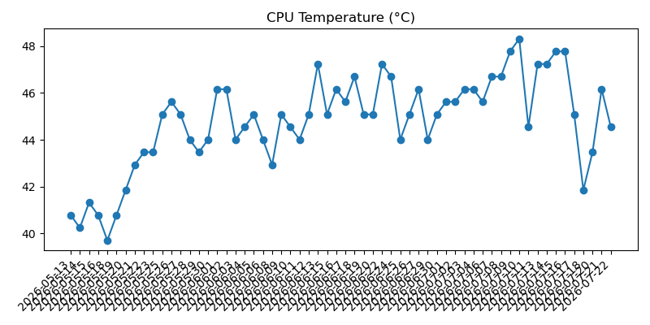
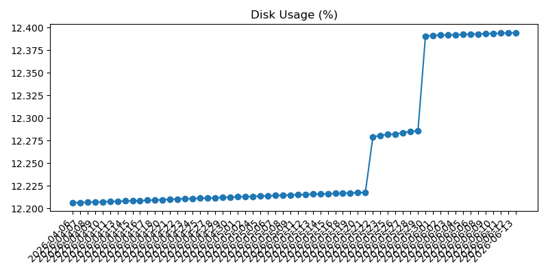

# Raspberry Pi Daily Status

This repository contains automated daily system reports generated by a Raspberry Pi.

Each day the device records a small snapshot of its status and pushes it to this repository automatically.

## System Trends

### CPU Temperature

### Disk Usage

## What is recorded

The report includes:

### Machine status
- Uptime
- CPU load averages
- RAM usage
- Disk usage
- CPU temperature
- Power / throttling status

### Network reachability
- Internet connectivity check
- Ping latency to a stable endpoint

### Weather
Daily weather summaries for:
- Madrid
- Barcelona

Including:
- Current condition
- Maximum temperature
- Minimum temperature
- Feels-like temperature
- Chance of rain
- Any reported warnings

### Health summary
A simple evaluation based on system metrics:
- Disk usage thresholds
- CPU temperature thresholds
- Power issues
- Internet connectivity

## Automation

A Python script runs daily via `cron` and:

1. Collects system metrics
2. Fetches weather data
3. Appends the report to the current monthly log file
4. Commits the change
5. Pushes the update to GitHub

## Repository structure

YYYY-MM.md

Each file contains the daily reports for that month.

Example:

2026-03.md
2026-04.md

## Security note

To avoid exposing sensitive information, the reports intentionally **do not include**:

- Hostname
- Local IP address
- Network identifiers

## Purpose

This project serves as:

- A lightweight Raspberry Pi health monitor
- A personal infrastructure log
- An automated GitHub activity project
